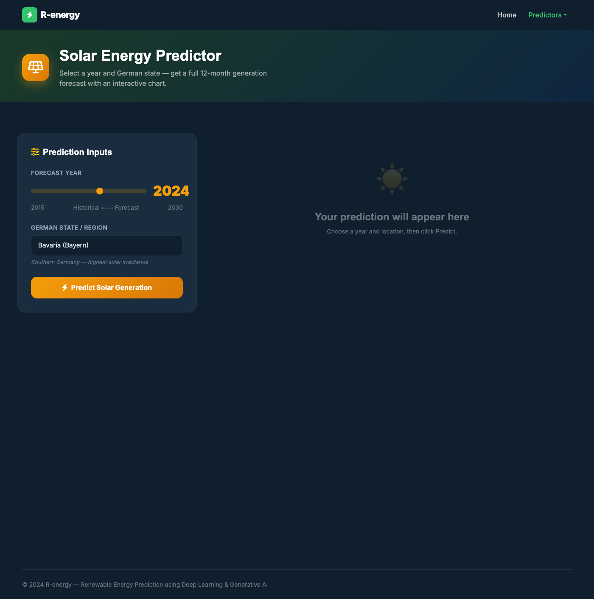
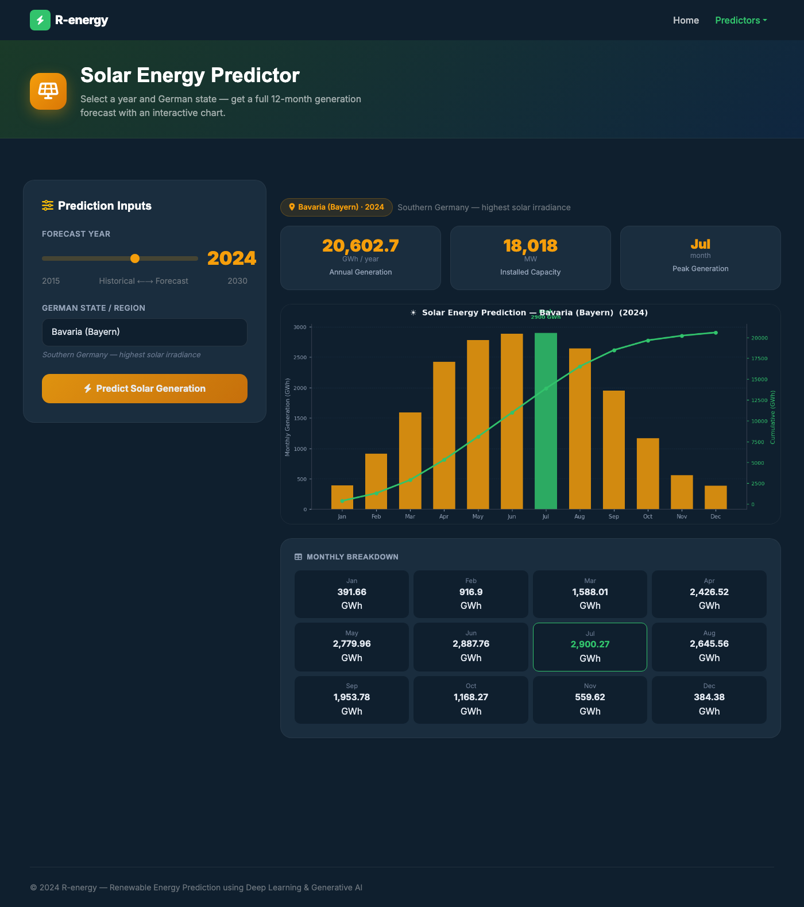
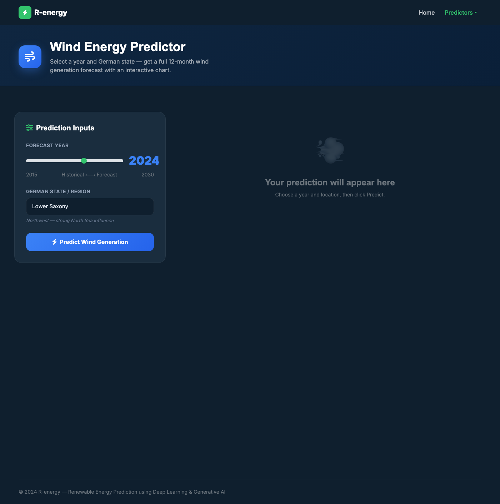
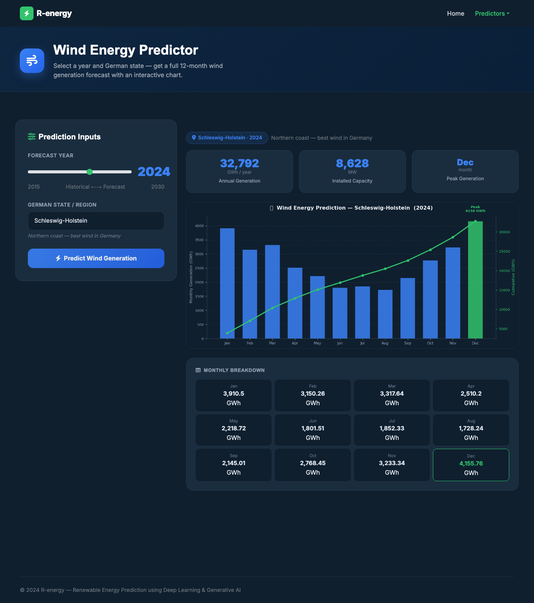

<h1 align="center">Renewable Energy Prediction Using Deep Learning & Generative AI</h1>

<p align="center">
  
  
  
  
  
</p>

<p align="center">
  A full-stack web application that predicts <strong>solar and wind energy output</strong> across German states using classical ML, deep learning (LSTM), and 10 years of real hourly grid data — with a generative engine that extrapolates capacity growth into future years.
</p>


---

## Table of Contents

- [Overview](#overview)
- [Live API — Sample Output](#live-api--sample-output)
- [Key Features](#key-features)
- [Tech Stack](#tech-stack)
- [Dataset](#dataset)
- [Data Preprocessing](#data-preprocessing)
- [Models & Results](#models--results)
- [Project Structure](#project-structure)
- [Getting Started](#getting-started)
- [API Reference](#api-reference)
- [How It Works](#how-it-works)
- [Screenshots](#screenshots)
- [Team](#team)

---

## Overview

Solar and wind energy are central to the global shift toward clean power — but their intermittent nature makes planning difficult. This project builds a prediction system that:

- Forecasts **monthly solar and wind energy generation (GWh)** for any of 12 German states across any year from 2015 to 2030+
- Derives real **seasonal generation profiles** from 10 years of hourly German grid data (2015–2024)
- Applies **location-specific capacity factors** — for example, Bavaria has Germany's highest solar irradiance; Schleswig-Holstein has its strongest wind corridor
- Uses a **generative capacity-growth engine** to linearly extrapolate installed MW into future years beyond the training data

Germany was chosen as the focus because it leads Europe in renewable adoption (~46% energy from renewables) and serves as a strong indicator of global trends.

---

## Live API — Sample Output

The app exposes a REST API. Here are real responses from the running server:

**Solar — Bavaria (Bayern), 2024**
```json
{
  "location": "Bavaria (Bayern)",
  "location_desc": "Southern Germany — highest solar irradiance",
  "year": 2024,
  "capacity_mw": 18018,
  "annual_gwh": 20602.7,
  "peak_month": "Jul",
  "monthly_gwh": [391.66, 916.90, 1588.01, 2426.52, 2779.96, 2887.76,
                  2900.27, 2645.56, 1953.78, 1168.27, 559.62, 384.38]
}
```

**Wind — Schleswig-Holstein, 2024**
```json
{
  "location": "Schleswig-Holstein",
  "location_desc": "Northern coast — best wind in Germany",
  "year": 2024,
  "capacity_mw": 8628,
  "annual_gwh": 32792.0,
  "peak_month": "Dec",
  "monthly_gwh": [3910.50, 3150.26, 3317.64, 2510.20, 2218.72, 1801.51,
                  1852.33, 1728.24, 2145.01, 2768.45, 3233.34, 4155.76]
}
```

**Future year forecast — Bavaria Solar, 2028** (generative extrapolation)
```json
{ "annual_gwh": 29155.7, "capacity_mw": 25498, "year": 2028 }
```

---

## Key Features

- **12 German states** — each with individually calibrated solar irradiance and wind corridor capacity factors
- **Historical + future forecasting** — 2015–2024 backed by real data; 2025–2030+ via generative capacity extrapolation
- **Multiple ML/DL models** — Ridge Regression, Lasso Regression, Decision Tree, SVM, Random Forest, LSTM
- **Automated model selection** — benchmarked on RMSE, MAE, and accuracy; best model saved per energy type
- **Keras Tuner** — automated hyperparameter optimization for the LSTM
- **Real-time chart generation** — Matplotlib renders dark-themed bar + cumulative line charts, returned as base64 PNG
- **Interactive web UI** — Flask backend + Bootstrap/JS frontend; no page reload required for predictions

---

## Tech Stack

| Layer | Technology |
|---|---|
| Backend | Python 3.10+, Flask 2.3+, Flask-CORS |
| Frontend | HTML5, CSS3, Bootstrap 5, JavaScript (Fetch API) |
| ML Models | scikit-learn — Ridge, Lasso, SVM, Random Forest, Decision Tree |
| Deep Learning | TensorFlow 2.13+, LSTM, Keras Tuner |
| Data & Visualization | pandas, NumPy, Matplotlib, Seaborn, statsmodels |
| Model Persistence | joblib (.pkl) |
| Dataset | Open Power System Data — Germany hourly, 2015–2024 |

---

## Dataset

Data sourced from [Open Power System Data](https://open-power-system-data.org/) — an open platform covering power systems across 37 European countries. The Germany dataset was selected for its completeness and renewable energy diversity (~10 years of hourly records).

**Key columns used:**
| Column | Description |
|---|---|
| `utc_timestamp` | Hourly time index |
| `DE_solar_capacity` | National installed solar capacity (MW) |
| `DE_wind_capacity` | National installed wind capacity (MW) |
| `DE_solar_profile` | Normalized solar generation profile |
| `DE_wind_profile` | Normalized wind generation profile |
| `DE_wind_onshore_profile` | Onshore wind profile |
| `DE_wind_offshore_profile` | Offshore wind profile |
| `DE_solar_generation_actual` | Target: actual solar generation |
| `DE_wind_generation_actual` | Target: actual wind generation |

**Germany national installed capacity (MW):**

| Year | Solar | Wind |
|------|------:|-----:|
| 2015 | 37,400 | 44,900 |
| 2018 | 45,200 | 59,300 |
| 2020 | 53,700 | 62,200 |
| 2022 | 66,500 | 66,300 |
| 2024 | 81,900 | 71,900 |

---

## Data Preprocessing

### Handling Null Values
- **Solar generation**: nulls filled from the previous day's value; first-of-month nulls set to 0 (pre-dawn assumption); remaining NaNs replaced with column mean.
- **Wind generation**: all nulls replaced with column mean.

### Correlation Analysis
Feature correlation identified the strongest predictors per target:
- **Solar**: `DE_solar_profile` had the highest correlation with solar output
- **Wind**: `DE_wind_profile`, `DE_wind_onshore_profile`, and `DE_wind_onshore_generation` were top predictors


### Feature Importance
Random Forest feature importance scores were computed alongside correlation analysis to remove low-signal variables, reducing model bias and improving generalization.

---

## Models & Results

Six models trained and evaluated on standard regression metrics (RMSE, MAE, Accuracy):

| Model | Best For | Notes |
|---|---|---|
| Ridge Regression | Solar & Wind | Regularized linear baseline |
| Lasso Regression | Solar & Wind | Sparse feature baseline |
| Decision Tree | — | Prone to overfitting |
| SVM | **Wind** | Best classical ML for wind |
| Random Forest | **Solar** | Best classical ML for solar; models saved as `.pkl` |
| **LSTM** | **Solar** | ~98.2% accuracy; best overall on solar |

**Saved production models:** `solar_rf.pkl` (Random Forest), `wind_rf.pkl` (Random Forest) — both with fitted scalers.


<p align="center"><em>LSTM — True values vs Predicted values (solar generation)</em></p>

---

## Project Structure

```
├── app.py                                       # Flask backend — all API routes & prediction logic
├── requirements.txt                             # Python dependencies
├── time_series_60min_singleindex_filtered.csv   # Germany hourly energy dataset (2015–2024)
├── models/
│   ├── solar_rf.pkl                             # Trained Random Forest model (solar)
│   ├── solar_scaler.pkl                         # Feature scaler (solar)
│   ├── wind_rf.pkl                              # Trained Random Forest model (wind)
│   └── wind_scaler.pkl                          # Feature scaler (wind)
├── website/
│   ├── index.html                               # Landing page (hero, about, models sections)
│   ├── output.html                              # Solar predictor page
│   ├── output_wind.html                         # Wind predictor page
│   ├── css/                                     # Bootstrap + custom styles
│   ├── js/                                      # Fetch API calls & chart rendering
│   └── img/                                     # Static assets
├── MAIN .ipynb                                  # Full model training & evaluation notebook
├── LSTM Code .ipynb                             # LSTM deep learning notebook
├── ANOTHER.ipynb                                # Supplementary analysis notebook
└── Collab Notebook-Arunkumar.ipynb              # Collaborative exploration notebook
```

---

## Getting Started

### Prerequisites
- Python 3.10+
- pip

### Installation

```bash
# Clone the repository
git clone https://github.com/arunkumaraluru/Renewable-Energy-prediction-using-Generative-AI.git
cd Renewable-Energy-prediction-using-Generative-AI

# Install dependencies
pip install -r requirements.txt
```

### Run the App

```bash
python app.py
```

The server starts at **http://localhost:5000**. You will see:
```
Loading dataset to derive seasonal profiles …
Seasonal profiles ready.
iEnergy server → http://localhost:5000
```

---

## API Reference

All endpoints are served from `http://localhost:5000`.

| Method | Endpoint | Description |
|---|---|---|
| `GET` | `/` | Landing page |
| `GET` | `/solar` | Solar predictor UI |
| `GET` | `/wind` | Wind predictor UI |
| `GET` | `/api/locations/solar` | List of 12 states for solar prediction |
| `GET` | `/api/locations/wind` | List of 12 states for wind prediction |
| `POST` | `/api/predict/solar` | Solar energy prediction |
| `POST` | `/api/predict/wind` | Wind energy prediction |

### POST `/api/predict/solar` and `/api/predict/wind`

**Request body:**
```json
{ "location": "Bavaria (Bayern)", "year": 2024 }
```

**Response fields:**

| Field | Type | Description |
|---|---|---|
| `annual_gwh` | float | Total annual generation in GWh |
| `monthly_gwh` | float[12] | Monthly breakdown (Jan–Dec) |
| `capacity_mw` | int | State installed capacity in MW |
| `peak_month` | string | Month with highest output |
| `location_desc` | string | Human-readable state description |
| `chart` | string | Base64-encoded PNG chart (dark theme) |
| `model` | string | Model identifier string |

**Solar locations (12 states):**
Bavaria, Baden-Württemberg, Saxony-Anhalt, Brandenburg, Saxony, Rhineland-Palatinate, Hesse, Thuringia, North Rhine-Westphalia, Lower Saxony, Schleswig-Holstein, Hamburg

**Wind locations (12 states):**
Lower Saxony, Schleswig-Holstein, Brandenburg, Mecklenburg-Vorpommern, Saxony-Anhalt, Hamburg, North Rhine-Westphalia, Thuringia, Hesse, Rhineland-Palatinate, Baden-Württemberg, Bavaria

---

## How It Works

1. **User selects** an energy type (solar/wind), a German state, and a target year via the web UI.
2. **Flask receives** the POST request and looks up the state's share of national installed capacity and its location-specific capacity factor.
3. **National capacity** for the chosen year is either looked up from historical data (2015–2024) or linearly extrapolated for future years.
4. **Monthly GWh** is computed as:
   ```
   GWh = monthly_CF × location_CF × state_capacity_MW × hours_in_month / 1000
   ```
   where `monthly_CF` is derived from the real seasonal mean of 10 years of hourly data.
5. **A chart** is generated (dark-themed bar chart + cumulative line) and returned as a base64 PNG alongside the JSON prediction.
6. **The frontend** renders the chart and a stats card showing annual total, peak month, and installed capacity — no page reload.

---

## Screenshots

### Landing Page


### Solar Energy Predictor — Input Form


### Solar Energy Predictor — Prediction Result (Bavaria, 2024 · 20,602 GWh)


### Wind Energy Predictor — Input Form


### Wind Energy Predictor — Prediction Result (Schleswig-Holstein, 2024 · 32,792 GWh)


---

<p align="center">Built for a sustainable energy future</p>
